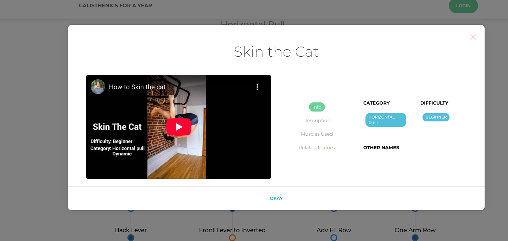
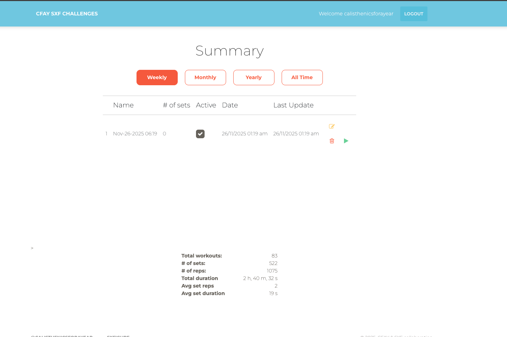
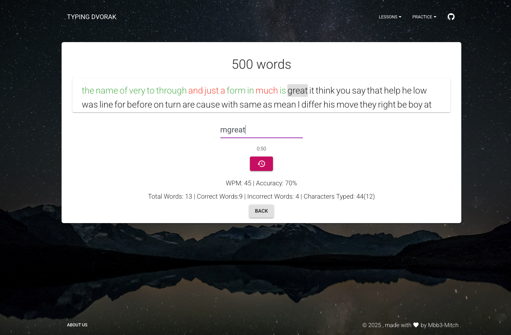

# (Under Construction)
# Engineering Portfolio: mbb3-mitch

> Building practical tools, shipping full-stack solutions, and learning by doing—this is my narrative.

---

## Repo Name & Positioning

- Repo: `engineering-portfolio-mbb3-mitch`
- Positioning: A curated showcase of my engineering projects—spanning internal tools, developer experience, prototypes, and pragmatic solutions across the stack.

## Folder Layout

```
/engineering-portfolio-mbb3-mitch
  /assets            # Screenshots, diagrams, logos (assets/<project>/...)
  /projects          # Individual project profiles: projects/<repo>.md
  README.md          # Main portfolio page
```

## Highlights

- 🛠 Builder of internal tools; developer productivity and experience focus.
- 🌐 Full-stack generalist: backend, frontend, DevOps.
- 💻 Cross-platform pragmatism: Mac, Windows, Linux.
- 🧑‍🔬 Prototypes and experiments, turning ideas into outcomes.
- 🌲 Calm, senior energy – tradeoffs, constraints, results matter.

---

## Project Index

Only showing projects with completed writeups.

| Project | Category | Stack | Links | 1-line Value |
|---------|----------|-------|-------|---------------|
| Calisthenics For A Year | Product | Django, DRF, React | [Profile](projects/cfay.md) · [Repo](https://github.com/mbb3-mitch/Calisthenics-For-A-Year) · [Live](https://calisthenicsforayear.com/) | Skill progression tracker with an API-first backend |
| CFAY SFX Challenges | Product | Django, DRF, React | [Profile](projects/cfay-sxf-challenges.md) · [Repo](https://github.com/mbb3/cfay-sxf-challenges) · [Live](https://challenges.calisthenicsforayear.com/#/) | Workout logging + analytics for challenge cohorts |
| Programmer Dvorak Typing Game | Experiment | React, Express | [Profile](projects/programmer-dvorak-typing-game.md) · [Repo](https://github.com/mbb3/programmer-dvorak-typing-game) · [Live](https://typingdvorak.com/) | Dvorak-focused typing drills with live stats |

---

## Project Groups

### 🏋️‍♂️ Fitness Platforms

- **Calisthenics For A Year**  
  Track skill progressions with Django/DRF + React; live at https://calisthenicsforayear.com/.  
    
  [Read more →](projects/cfay.md)

- **CFAY SFX Challenges**  
  Challenge-focused workout logger with analytics dashboards.  
    
  [Read more →](projects/cfay-sxf-challenges.md)

### 🎮 Learning & Experiments

- **Programmer Dvorak Typing Game**  
  Dvorak-specific typing drills with live stats and lesson tracks.  
    
  [Read more →](projects/programmer-dvorak-typing-game.md)

---
