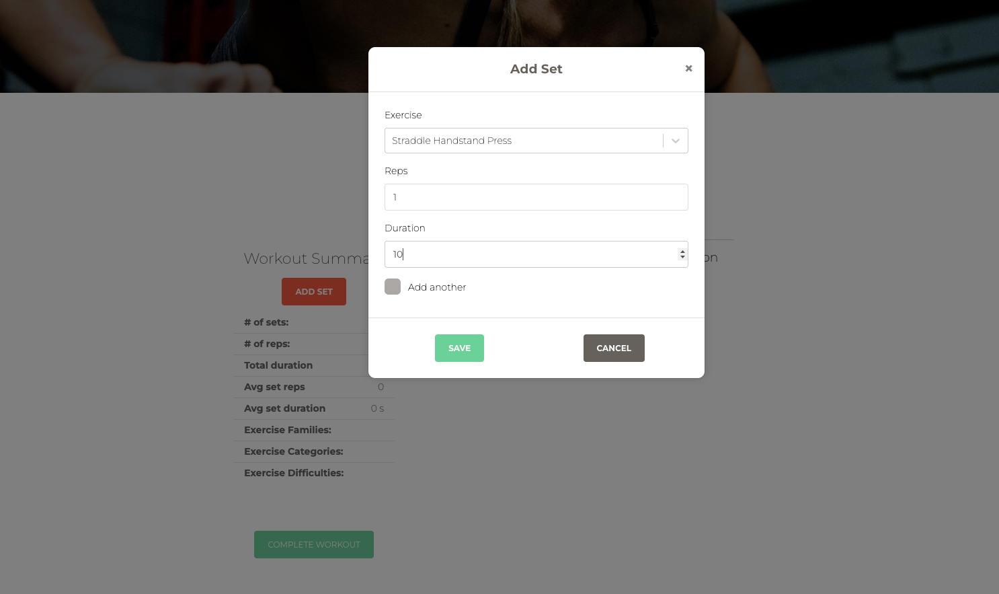

# CFAY SFX Challenges

## What it is
Full-stack Django + React workout tracker built for CFAY SFX challenge participants. Lets members log workouts, exercises, and sets with basic analytics to stay accountable. Early-stage prototype to prove out the flow before a fuller rollout.

## Why it exists
Built to support a specific challenge cohort with lightweight logging and analytics, while providing a sandbox to iterate on Django/DRF + React patterns.

## What I built
- Token-based auth with Knox plus register/login screens; protected dashboard and workout routes
- Create workouts, exercises, and sets; active workouts auto-targeted when adding sets
- Aggregated metrics per workout and profile (total reps, duration, averages, categories/families/difficulties)
- React UI with sortable workout tables, summaries, alerts, and loading states via Redux
- REST API via Django REST Framework with serializers for workouts, sets, exercises, and profiles

## Tech Stack
- Backend: Django 3, Django REST Framework, django-rest-knox, PostgreSQL, Gunicorn (deploy)
- Frontend: React 17, Redux + Thunk, React Router, Reactstrap/Paper Kit, SCSS
- Tooling: Webpack 5 + Babel, ESLint/Prettier, Axios, Moment, humanize-duration

## Notable Decisions
- Keep backend and SPA co-located so Django serves the built React bundle
- Use Knox for quick token auth and route guards without custom JWT wiring
- Store workout analytics on the backend to keep calculations consistent across clients
- Rely on Redux for shared loading states and alerts across dashboard routes

## What I'd Do Next
- Flesh out analytics tabs (weekly/monthly/yearly/all-time) with real filtering and charts
- Add CRUD UI for exercise metadata (categories, families, difficulties) with validation
- Expand API/frontend tests and wire into CI
- Improve auth UX (password reset, email verification, clearer errors)
- Seed fixtures for common exercises and sample workouts for faster onboarding

## Links
- Production: [https://challenges.calisthenicsforayear.com/#/](https://challenges.calisthenicsforayear.com/#/)
- GitHub Repo: [https://github.com/mbb3/cfay-sxf-challenges](https://github.com/mbb3/cfay-sxf-challenges)

## Screenshots

