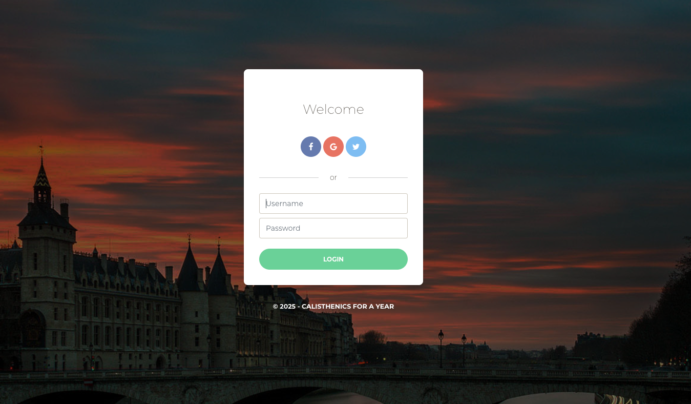
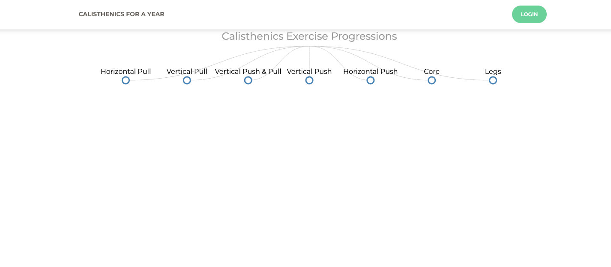
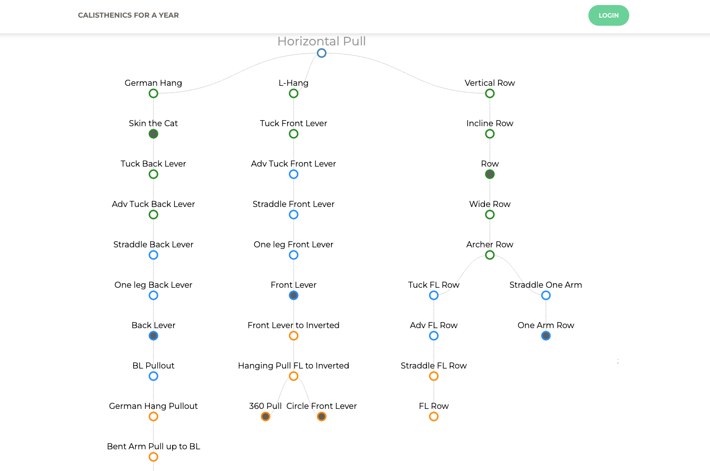

# Calisthenics For A Year

## What it is
Full-stack app to explore calisthenics progressions, catalog skills, and manage authenticated users. Built to centralize scattered variations and training notes with a Django/DRF backend and React frontend. Production: [https://calisthenicsforayear.com/](https://calisthenicsforayear.com/) (content updates are admin-only).

## Why it exists
Started as a way to organize personal calisthenics knowledge and try out Django REST Framework plus React/Redux in a cohesive, API-first app.

## What I built
- Token-based auth (Knox) with register/login endpoints and profile images
- Skill catalog with metadata (difficulty, category, muscles, injuries, videos)
- React progression explorer with embedded media per movement
- Static React build served by Django for a unified deploy

## Tech Stack
- Backend: Django 3, Django REST Framework, django-rest-knox, django-environ, Pillow
- Frontend: React 16 with Redux, Reactstrap, node-sass (Create React App toolchain)
- Data: PostgreSQL via `DATABASE_URL`

## Notable Decisions
- API-first design so skills can be consumed by other clients beyond the web UI
- Served CRA build directly from Django to simplify deployment footprint
- CORS opened to [http://localhost:3000](http://localhost:3000) for local React dev and API proxying
- Knox token auth for quick session handling without rolling custom JWT logic

## What I'd Do Next
- Harden auth (password reset, email verification) and add rate limiting
- Track skill progression per user with history logging
- Expand API validation/tests for profiles and skills; add CI for lint/test/build
- Seed common skills and demo users for faster onboarding

## Links
- GitHub Repo: [https://github.com/mbb3-mitch/Calisthenics-For-A-Year](https://github.com/mbb3-mitch/Calisthenics-For-A-Year)
- Demo/Site: [https://calisthenicsforayear.com/](https://calisthenicsforayear.com/)

## Screenshots

